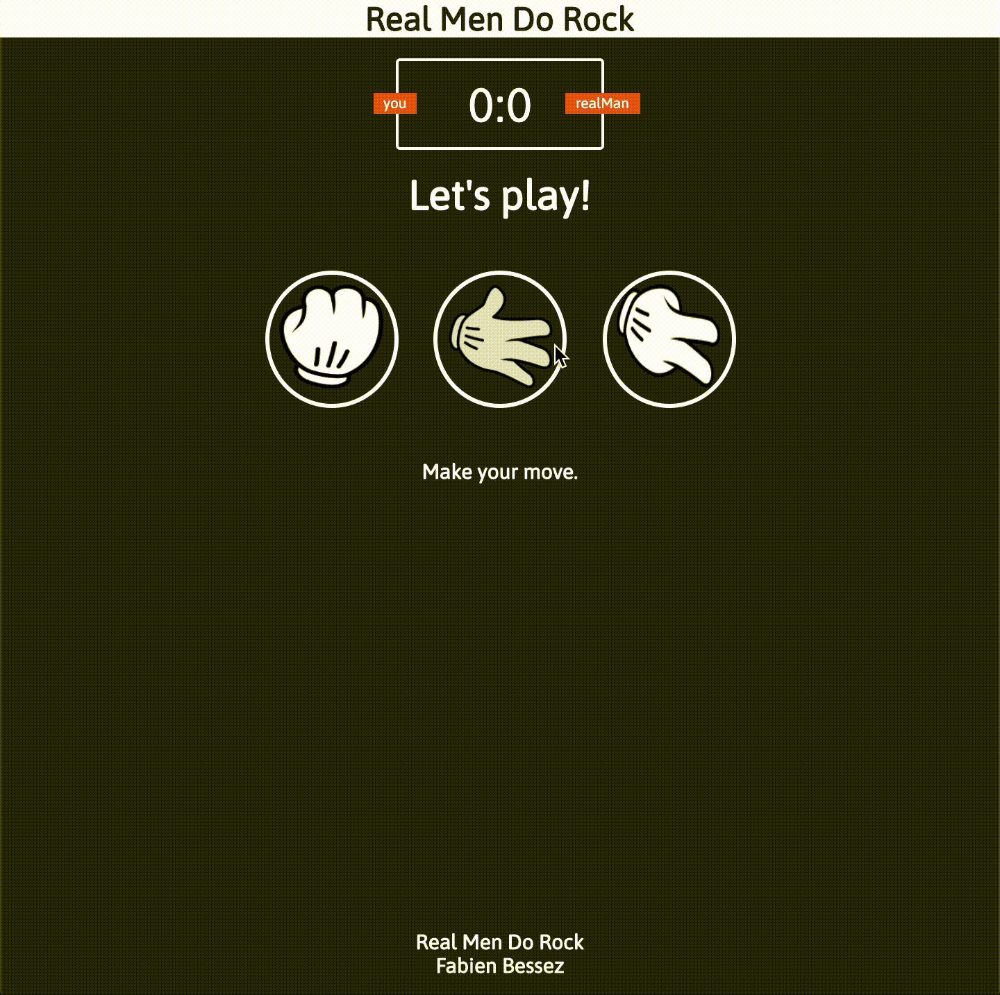

# Rock

Rock, Paper, Scissors but the Computer always plays Rock. A bit sarcastic.

I came across [this research](https://www.psychologytoday.com/us/blog/the-blame-game/201504/the-surprising-psychology-rock-paper-scissors) and thought it'd be a quick, funny project to practice some fundamentals.

